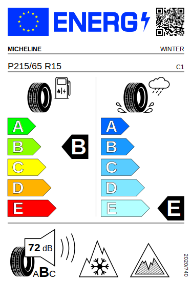
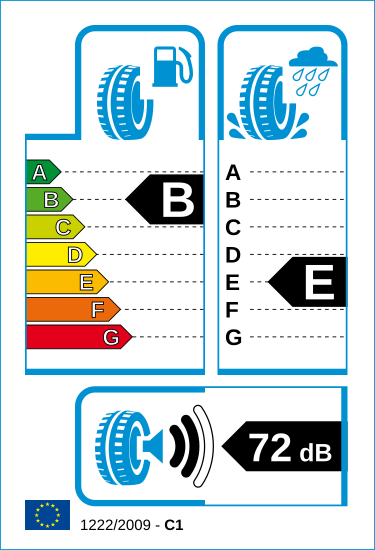

# EU Tire Label

According to the regulation
[EU/2020/740](https://eur-lex.europa.eu/legal-content/EN/TXT/PDF/?uri=CELEX:32020R0740&from=EN) of
the European Parliament and of the Council of 25 May 2020 on the labeling of tires with respect to
fuel efficiency and other parameters all manufacturers of tires for cars, light and heavy trucks
are obliged to present to the customer QR code with a link to EPREL database, fuel efficiency, wet
grip and external rolling noise classification of every tire sold in European Union market in a
form of Tire Label specified by this regulation. This obligation comes into force on May 1, 2021
and it supersedes European Tire Labeling Regulation
[EC/1222/2009](http://eur-lex.europa.eu/LexUriServ/LexUriServ.do?uri=OJ:L:2009:342:0046:0058:en:PDF)
which has been in force since October 2012.

This project (EU-tire-label) aims to simplify label generation and distribution in the web-based
services (manufacturer website, E-commerce, etc.). It supports both mentioned earlier
specifications: EU/2020/740 and EC/1222/2009.

## Installation

```sh
mkdir build && cd build
cmake -DENABLE_CGI=ON -DENABLE_PNG=ON ..
make && make install
```

Dependencies:

* [QRCode](https://github.com/ricmoo/QRCode) - downloaded automatically during configuration
* [librsvg](https://wiki.gnome.org/Projects/LibRsvg) - required if PNG output support was enabled

## Usage

As a standalone executable:

```sh
# EU/2020/740 labels (--eprel-url option present)
eu-tire-label --eprel-url=http://eprel.eu/624150 --trademark=MICHELINE --tire-size="P215/65 R15" \
    --tire-type=WINTER --tire-class=1 --fuel-efficiency=B --wet-grip=E --rolling-noise=B \
    --rolling-noise-db=72 --snow-grip --ice-grip >tire-label-MICHELINE-1-B-E-2-72.svg
eu-tire-label --eprel-url=http://eprel.eu/624150 --trademark=MICHELINE --tire-size="P215/65 R15" \
    --tire-type=WINTER --tire-class=1 --fuel-efficiency=B --wet-grip=E --rolling-noise=B \
    --rolling-noise-db=72 --snow-grip --output-png=350 >tire-label-MICHELINE-1-B-E-2-72.png
```

```sh
# EC/1222/2009 labels
eu-tire-label --tire-class=1 --fuel-efficiency=B --wet-grip=E \
    --rolling-noise=2 --rolling-noise-db=72 >tire-label-1-B-E-2-72.svg
eu-tire-label --tire-class=1 --fuel-efficiency=B --wet-grip=E \
    --rolling-noise=2 --rolling-noise-db=72 --output-png=350 >tire-label-1-B-E-2-72.png
```

As a CGI application using e.g. Apache HTTP server. Note, that for convenience the query string is
case insensitive.

```sh
wget "http://localhost/cgi-bin/eu-tire-label?c=1&f=b&g=e&r=2&n=72"
wget "http://localhost/cgi-bin/eu-tire-label?c=1&f=b&g=e&r=2&n=72&png=350"
wget "http://localhost/cgi-bin/eu-tire-label?u=http://eprel.eu/624150&m=MICHELINEs=P215/65+R15&t=WINTER&c=1&f=b&g=e&r=b&n=72&w&i"
```

## Examples



